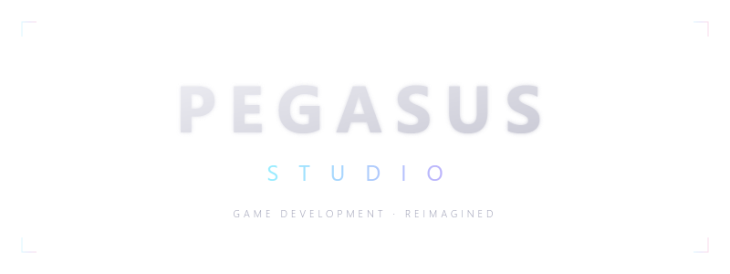

<p align="center">
  
</p>

<h1 align="center">Pegasus Studio</h1>

<p align="center">
  A browser-based 3D game editor powered by Three.js
</p>

<p align="center">
  
  
  = 16" />
  
  
</p>

---

## Features

### 3D Scene Editor
- Translate, rotate, and scale gizmos with axis locking
- Grid snapping and configurable grid size
- Multi-view scene graph with collapsible hierarchy
- Orbit, pan, and zoom camera controls

### Asset Library
- **800+ models** from Kenney asset packs (CC0), organized by category
- Drag-and-drop model placement from a searchable palette
- Upload custom `.glb` / `.gltf` models
- Texture browser with PBR material support (color, normal, roughness maps)

### Terrain & World Building
- Terrain draw mode with adjustable brush size
- Sculpt mode for height editing
- PBR texture painting from 24 AmbientCG texture sets
- 20 object types: buildings, roads, paths, interiors, furniture, props, lights, and more

### Infrastructure
- Multi-project support with a dashboard
- User authentication (file-based, no external database required)
- Auto-save with project versioning
- Zero dependencies beyond Node.js — no build tools, no bundler

---

## Quick Start

```bash
# Clone the repository
git clone https://github.com/Daniel-Farmer/Pegasus-Studio.git
cd Pegasus-Studio

# Download assets (models + textures) — ~370MB
bash scripts/setup.sh

# Start the server
node server.js

# Open in your browser
# http://localhost:2003
```

> The editor runs entirely in the browser. The Node.js server handles file storage and authentication only.

---

## Project Structure

```
├── editor.html          # Main 3D editor
├── dashboard.html       # Project management dashboard
├── login.html           # Authentication page
├── server.js            # Node.js static + API server
├── js/
│   ├── main.js          # Editor entry point & engine
│   ├── geometry.js      # Object builders & mesh generation
│   ├── controls.js      # Camera & input handling
│   ├── collision.js     # Collision detection
│   ├── constants.js     # Scene schema & configuration
│   ├── world.js         # World/terrain management
│   └── lib/             # Three.js & GLTFLoader
├── lib/                 # Server-side modules (auth, projects, store)
├── css/                 # Stylesheets
├── scripts/
│   ├── setup.sh         # Asset download & catalog generation
│   ├── fetch-textures.sh# PBR texture downloader
│   └── build-catalog.js # Model catalog generator
├── models/              # GLB model files (downloaded via setup.sh)
└── textures/            # PBR textures (downloaded via setup.sh)
```

---

## Tech Stack

| Layer | Technology |
|-------|-----------|
| 3D Engine | [Three.js](https://threejs.org/) r150 |
| Language | Vanilla JavaScript (IIFE modules) |
| Server | Node.js (zero npm dependencies) |
| Models | [Kenney](https://kenney.nl/) asset packs (CC0) |
| Textures | [AmbientCG](https://ambientcg.com/) PBR sets (CC0) |

---

## License

MIT — see [LICENSE](LICENSE).

## Credits

- **3D Models** — [Kenney.nl](https://kenney.nl/) (CC0 1.0 Universal)
- **PBR Textures** — [AmbientCG](https://ambientcg.com/) (CC0 1.0 Universal)
- **3D Engine** — [Three.js](https://threejs.org/)
